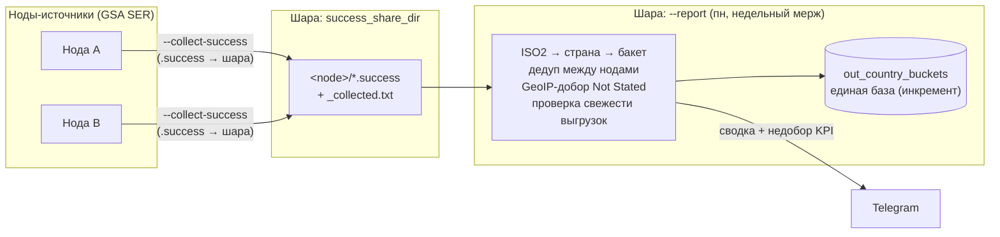

# gsa-checker — автоматизация и мониторинг GSA Search Engine Ranker

Зеркало подхода [`Aparser-checker`](../Aparser-checker), но для **GSA SER**. Цель та же:
создавать проекты, заполнять входными данными, менять настройки, собирать статистику,
видеть **остаток целей** (сколько ещё не обработано).

## Ключевое отличие от A-Parser: у GSA SER НЕТ HTTP API

GSA SER — нативное Windows-приложение без API. Поэтому интерфейс **гибридный**:

| Что делаем | Как |
|------------|-----|
| Остаток целей, статистика (submitted/verified) | **чтение файлов** проектов (папка `projects`) |
| Массовое создание проектов, заливка списков целей | **запись файлов** `.prj` / импорт |
| Живые правки настроек запущенного GSA | **UI-автоматизация** (pywinauto/AutoIt) — `lib/ui.py`, в работе |

Место в конвейере: keygen → A-Parser парсит футпринты → списки URL падают в
`\\share\for_gsa_ser\<батч>\*.txt` → **сюда** их импортирует gsa-checker как цели проектов.

## Структура

```
gsa_checker.py          # CLI-точка входа (все команды)
config.example.json     # шаблон конфига → скопировать в data/gsa_checker.config.json
lib/
  prj.py                # парсер/редактор .prj (round-trip байт-в-байт, surrogateescape)
  buckets.py            # раскладка страна → бакет (порт логики split1404)
  iso2.py               # ISO2-код страны → английское название
  geoip.py              # страна по IP (MaxMind/DB-IP .mmdb), опционально
  emails.py             # генератор [email accounts]
  spin.py               # шаффл спинтакса (рандомизация текстовых полей)
  telegram.py           # отправка уведомлений (прямая/прокси/релей)
  statsdb.py            # SQLite time-series (скорость/ETA)
  ui.py                 # UI-автоматизация GSA (pywinauto, только Windows)
tests/                  # pytest: маппинг ISO2 → страна → бакет
data/                   # рабочие данные (конфиг/состояние/БД/логи) — НЕ в git
```

## Архитектура: централизованный недельный мерж

Ноды-источники (серверы с GSA) кладут свои `.success` на общую шару; отдельная роль
«шара» раз в неделю сливает их одной командой `--report` и шлёт результат в Telegram.
Ролевые имена, без привязки к конкретным хостам.



Отдельно **автопилот** (`--autopilot`) на каждой ноде раздаёт цели из общего пула батчей
в проекты с именем `Split` (см. Engineering Decisions).

## Инженерные решения (Engineering Decisions)

**Почему `.success` как источник статистики (а не UI-выгрузка).** GSA уже определяет
страну ссылки и **пишет её прямо в файл** `.success` (предпоследнее поле — ISO2-код: по
ccTLD, а для gTLD — по IP), последнее поле — IP. То есть страна и URL доступны на диске
без запуска GSA и без хрупкой UI-автоматизации (owner-drawn меню). Проверка на реальной
выгрузке: ccTLD-страна из файла ↔ страна из UI-отчёта GSA совпали 1:1, а «прямой GeoIP по
IP на всё» давал ~45% (IP — это адрес хостинга, а не зоны домена). Итог: читаем `.success`
(инкрементально, append-only) → страна = код GSA; GeoIP включаем только чтобы добить
пустые коды (`Not Stated`). Никакого UI в штатном пути.

**Почему централизованный мерж на шаре (а не каждая нода сама).** База бакетов
`out_country_buckets` — **одна на весь парк**. Если бы каждая нода мержила в неё сама:
(1) ноды дрались бы за один файл; (2) недельная «прибавка» считалась бы по части данных,
а не по всему парку; (3) **дедуп между нодами не работал бы** — одна и та же ссылка с двух
нод попала бы в базу дважды. При централизованной схеме шара видит `.success` со всех нод
разом: дедуп ловит пересечения (проверено: два одинаковых входа дают прибавку не ×2, а ×1),
а KPI считается по общему приросту. Плюс проверка свежести (`_collection_status`) по метке
`_collected.txt` — если нода не выложилась, сводка это подсветит, а не смержит вслепую.

**Почему белый список `Split` + атомарный захват батчей.** (а) *Кого кормить* — по имени:
`autopilot_include_names` (по умолч. `Split`), т.к. флаг active/inactive в `.prj` файлово не
различить; белый список безопаснее чёрного — новый посторонний проект не начнёт получать
цели просто потому, что появился в папке. (б) *Общий пул* — если несколько нод берут батчи
из одной папки, наивная схема «раздать цели, потом перенести батч» даёт **гонку**: один
батч уходит на обе ноды (дубли целей). Решение — **атомарный захват**: нода сперва
`move` батч из пула в `used` (атомарная операция ФС), и раздаёт только то, что реально
захватила; у второй ноды `move` упадёт → батч пропущен. Так один батч гарантированно
достаётся ровно одной ноде.

## Панель управления (control plane)

Цель — управлять всеми системами (начиная с автопилота) с одного сайта. Слои:

```
Сайт (Cloudflare Pages, роль master)
  → orchestrator.py на шаре  — один API: реестр нод, фан-аут команд, агрегация статуса
      → agent.py на каждой ноде  — authenticated HTTP, запуск разрешённых команд
          → gsa_checker.py (autopilot / report / backup / …)
```

**`orchestrator.py`** (на шаре) — единая точка входа для сайта: знает все ноды (реестр
`nodes` в конфиге: `name` → `url` агента + `token`), параллельно опрашивает их и агрегирует.
Свой Bearer-токен (`orchestrator_token`); токены нод наружу (в `/nodes`) не отдаёт; сам
произвольных команд не выполняет — только передаёт имя действия агенту, а whitelist
проверяет агент (защита в глубину). Недоступная нода деградирует в `{error}`, а не роняет
ответ. Аудит — `data/orchestrator_audit.jsonl`. Bind по умолчанию `127.0.0.1` — наружу
только через Cloudflare Tunnel/VPN.
```
python orchestrator.py                  # реестр/токен/bind — из конфига
```
Эндпоинты: `GET /health` (без токена) · `GET /nodes` · `GET /status` (фан-аут по всем нодам)
· `POST /run {"target":"NODE|all","action":"…"}` → `{node: {job_id}}` · `GET /job/<node>/<id>`
(проксирует агент). **`agent.py`** — см. раздел про node-агент.

## Что уже готово

### Остаток целей (`--remaining`)
Считает непереработанные цели по проектам = число строк в файлах кэша целей
(шаблон `target_cache_glob`, по умолчанию `*.new`, `*.targets`). Быстрый побайтовый
подсчёт (файлы бывают на сотни МБ), игнор пустых строк, файлы одного проекта
суммируются, имя проекта берётся из `.prj` если удаётся распарсить.

```
cp config.example.json data/gsa_checker.config.json   # впишите gsa_projects_dir
python gsa_checker.py --check       # диагностика: путь, расширения файлов в папке проектов
python gsa_checker.py --remaining   # таблица остатка + итог
python gsa_checker.py --remaining --json
```

> **`--check` запускать первым** на реальном сервере: он покажет, какие расширения
> лежат в папке проектов, — по ним уточняется `target_cache_glob` под вашу версию GSA.

### Автопилот (`--autopilot`)
Кормит проекты равномерно из общего пула. **Заливает цели ТОЛЬКО в проекты, чьё имя
содержит `autopilot_include_names` (по умолч. `Split`)**, и дополнительно режет тех, чьё
имя содержит `autopilot_exclude_names` (`CC`/`TEST`/`Common`) — так `Split TEST` не получит
целей, а новый посторонний проект в папке не начнёт кормиться сам собой.

> **Важная асимметрия:** цели заливаем только в `Split`-проекты, а **verified читаем со
> ВСЕХ** проектов (`--report` не фильтрует по имени) — неактивные новых ссылок не добавят,
> но их накопленная база нужна в статистике.

Когда у
любого проекта остаток ниже `autopilot_min_targets`, берёт новейшие неиспользованные
батчи из `autopilot_pool_dir` (до `autopilot_batch_limit_mb` МБ) и делит их цели
**поровну** между проектами (каждому свой кусок, дописывает в `.new_targets`, данные не
стирает). Использованные батчи переносит в `autopilot_used_dir`. При `--apply` в конце
делает один `--ui-refresh`. Раз в `email_reminder_days` шлёт напоминание обновить почты.
```
python gsa_checker.py --autopilot            # превью (сухой прогон)
python gsa_checker.py --autopilot --apply     # раздать + перенести батчи + рефреш
```
> Ставить в планировщик раз в час (GSA запущен). Новые проекты НЕ создаёт.

**Статистика забора на шару.** Если задан `autopilot_stats_dir`, каждый прогон с раздачей
дописывает строку в `autopilot_stats_dir/<server_name>.jsonl` (append-only журнал по
серверу): `{ts, date, server, urls, batches, projects, mb, skipped_nonurl}` — сколько URL
забрано из пула. По этим журналам со всех серверов удобно строить сводную статистику
(сколько целей залито по дням/серверам). Папку на шаре создать с правом записи серверам.

### Node-агент (`agent.py`) — фундамент панели управления
Маленький authenticated HTTP-сервис на КАЖДОЙ ноде: панель управления (сайт/оркестратор)
вызывает его напрямую, чтобы запускать разрешённые команды gsa-checker и снимать статус.
Только stdlib — работает на Windows-ноде без pip. Первый кирпич control plane (дальше —
оркестратор + управление с сайта).

Безопасность (важно перед выкладкой):
- **только whitelist действий** — action → фиксированный argv, без shell и без подстановки
  пользовательских аргументов (произвольную команду выполнить нельзя). Мутирующие `.prj`
  команды (`respin`/`settings`/`emails`) в дефолт НЕ входят — добавляются явно через
  `agent_actions`;
- **Bearer-токен** на все действия (кроме `/health`), сравнение constant-time; токен —
  в gitignored `data/gsa_checker.config.json` (`agent_token`), в коде/логах не светится;
- **аудит** каждого вызова в `data/agent_audit.jsonl`;
- bind по умолчанию `127.0.0.1` — держать за VPN/файрволом; LAN/VPN задавать явно.
```
python agent.py                 # bind/token/actions — из конфига (agent_bind/agent_token)
```
Эндпоинты: `GET /health` (без токена) · `GET /actions` · `GET /status` (остаток/последний
забор автопилота) · `POST /run {"action":"…"}` → `{job_id}` · `GET /job/<id>` (статус+хвост
лога). Длинные действия (`autopilot`/`report`) идут в фоне: `/run` сразу отдаёт `job_id`.
Дефолтный whitelist: `remaining`, `stats`, `report[-dry]`, `autopilot[-dry]`, `collect`,
`backup`.

### UI-рефреш GSA (`--ui-check` / `--ui-refresh`)
После файловой дозаливки (`--autopilot`) GSA нужно «толкнуть», чтобы подхватил новые
цели. `lib/ui.py` на **pywinauto** (только Windows; на Linux команды дают понятную
ошибку, остальной gsa-checker не задет — импорт ленивый).
```
pip install pywinauto                    # на Windows-сервере с запущенным GSA
python gsa_checker.py --ui-check          # выгрузит структуру окна в data/ui_controls.txt
python gsa_checker.py --ui-refresh         # рефреш (шаги через ui_* в конфиге)
```
Селекторы под конкретный билд — в конфиге: `ui_window_title`, `ui_backend`
(`uia`/`win32`), `ui_select_all`, `ui_context_item` (пункт правого клика, напр. `Active`),
`ui_refresh_keys` (напр. `{F5}`). **Порядок ввода в строй:** сначала `--ui-check`, по
дампу настроить `ui_*`, затем `--ui-refresh`.

### Создание проекта (`--create`)
Собирает готовый к импорту проект: `.prj` из шаблона (`gsa_template_prj`) с проставленными
`URL`/`Keywords` + `.targets` из батча целей (файл или папка `for_gsa_ser`, дедуп, `--limit`).
Пишет в `create_out_dir`, живой GSA не трогает.
```
python gsa_checker.py --create --name Brave-0001 --url https://site/ \
  --keywords "kw1, kw2" --targets "\\share\for_gsa_ser\09-07" --limit 8000
# --dry-run — превью; --force — перезапись; --template/--out — переопределить пути
```
Импорт: скопировать созданные файлы в `gsa_projects_dir` (при закрытом GSA) или
импортировать через GSA. Заливка emails/статей — как и раньше через `fill_gsa_emails`/Spin-generator.

> В цели попадают только строки-URL (`http(s)://…`). Обычный текст/ключи из входного
> файла пропускаются; файл без единого URL — предупреждение (вероятно, не тот файл).
> Действует и в `--create`, и в `--autopilot`.

### Обновление почт (`--emails`)
Перегенерирует секцию `[email accounts]` в `.prj` свежими почтами (уникальный набор на
проект, `emails_per_project` штук, провайдер `email_provider_ini`). Формат нативный для
GSA — разделитель один байт `0xFF` (в отличие от `fill_gsa_emails`, где символ `ÿ` под
UTF-8 давал два байта). Остальное в `.prj` не трогает. Сухой прогон по умолчанию,
`--apply` пишет с бэкапом `.prj.bak`; `--only`/`--count` — фильтр/переопределение.
```
python gsa_checker.py --emails --count 20                # превью по всем проектам
python gsa_checker.py --emails --only fr --apply          # обновить французские
```
> ⚠ Делать при **закрытом GSA** (как `--settings`). Провайдер (`*.email.ini`) должен
> существовать в настройках GSA.

### Бэкап проектов (`--backup`)
Снимок всех `.prj` (фильтр `--only`) в `backup_dir/<server>_<дата-время>[_tag]/` — с
**историей** (в отличие от `.prj.bak`, который перезаписывается). Прунит старые снимки до
`backup_keep` (по умолч. 20). Мутирующие команды (`--respin`/`--settings`/`--emails`) при
`--apply` **сами делают такой снимок** перед правкой (если задан `backup_dir` и не `--no-backup`)
— так любой прогон можно откатить.
```
python gsa_checker.py --backup --only Split         # ручной снимок
```
Конфиг: `backup_dir` (папка на шаре), `backup_keep` (сколько снимков хранить).

### Пересборка проектов (`--respin`)
Делает дублированные проекты не-клонами: **рандомизирует текстовые поля** `[data_value]`
шаффлом спинтакса (порядок вариантов в `{a|b|c}` перемешивается — уникально на диске, но
спин сохранён, `%макросы%` и не-спин поля не трогаются), **генерит свежие почты**
`[email accounts]` и **ставит движки по белому списку** (если задан `keep_engines_file` —
включает только перечисленные там, остальные выключает; список = движки, реально дающие
verified). `[Options]` — байт-в-байт не трогает.
```
python gsa_checker.py --respin --only Split --dry-run    # превью
python gsa_checker.py --respin --only Split --apply        # записать (GSA закрыт, бэкап .prj.bak)
python gsa_checker.py --respin --no-emails --only Split    # только текст, почты не трогать
python gsa_checker.py --respin --no-engines --only Split   # не применять whitelist движков
```
`respin_fields` сузит набор текстовых полей (по умолч. все спин-поля). `keep_engines_file` —
путь к списку рабочих движков (по одному имени на строку; всё, чего в нём нет, выключается);
без него движки не трогаются. `--count` — почт на проект. ⚠ Как `--settings`/`--emails`:
при **закрытом GSA** (бэкап `.prj.bak`).

### Массовая правка настроек (`--settings`)
Меняет `[Options]`/`[engines]` в пачке `.prj` (`lib/prj.py` — построчный редактор,
round-trip байт-в-байт, сохраняет спин-синтаксис и разделитель `0xFF` в аккаунтах).
Сухой прогон по умолчанию; `--apply` пишет с бэкапом `.prj.bak`; `--only` — фильтр.

```
# показать, что изменится (без записи):
python gsa_checker.py --settings --set "engines:Askbot=0" --set "Options:use random url=1"
# записать только во французские проекты (GSA закрыт!):
python gsa_checker.py --settings --set-file changes.txt --only fr --apply
```

> ⚠ Делать при **закрытом GSA**: он держит проекты в памяти и перезапишет `.prj`
> при выходе, затерев файловые правки.
>
> **Отметка в notes + форс-перезапись.** При `--apply` каждая правка дописывает строку в
> поле `notes` проекта (видно в GSA → Modify Project → Notes), напр.
> `[gsa-checker 2026-07-22 02:39: settings: правок 235, изменено 235]`. По ней проверяешь,
> **прижилась ли правка**: закрыл GSA → применил → открыл GSA → смотришь notes. Если
> отметки нет — GSA был открыт и откатил `.prj` (перезапусти при закрытом GSA). `--settings`
> на `--apply` переписывает файл даже если значения уже на месте (форс) — чтобы отметка
> ставилась всегда. Так же штампуют `--respin`/`--emails`.

### Статистика (`--stats`)
Снимок по каждому проекту — считает строки в реальных data-файлах GSA:

| Метрика | Файл |
|---------|------|
| остаток целей | `.targets` |
| verified (размещено) | `.success` |
| на проверку | `.verify` |
| обработано URL | `.urls_done` |

```
python gsa_checker.py --stats          # таблица по проектам + итог
python gsa_checker.py --stats --json    # для централизованного сбора
```

Каждый прогон `--stats`/`--notify` пишет снимок в SQLite (`data/gsa_stats.db`,
`lib/statsdb.py`). Как накопится история (≥2 снимка за `eta_window_min`), в `--stats`
появляются колонки **ЦЕЛЬ/Ч** (скорость расхода) и **ETA** (прогноз до исчерпания
`.targets`; `СТОП` — если проект встал). Ретенция — `stats_retention_days`.

### Выгрузка результатов (`--export`)
Выгружает verified-ссылки (`.success`) в **CSV со страной** в папку `export_dir` на шаре.
**Инкрементально:** по офсету в `data/gsa_checker.state.json` берёт только новые ссылки.
Колонки: `project, country, country_src, url, date, engine, type, anchor, target`.

**Определение страны — как в GSA + добор GeoIP:**
- по **ccTLD** домена (`.pl`→Poland, `.ru`→Russia) — точно как GSA (`country_src=tld`);
- для **gTLD** (`.com/.net`, у GSA «без страны») — если задан `geoip_db`, добираем по
  **IP-GeoIP** (резолв домена → IP → MaxMind GeoLite2-Country), `country_src=ip`.

GeoIP опционален: `pip install maxminddb` + файл `GeoLite2-Country.mmdb` (бесплатно у
MaxMind), путь в `geoip_db`. Без него `.com` остаётся `gTLD`. Резолв кэшируется
(`data/geoip_cache.json`) — DNS медленный, первый прогон дольше.
```
python gsa_checker.py --export           # выгрузить новое → CSV + сводка по странам
python gsa_checker.py --export --dry-run  # превью без записи (офсеты не двигаются)
python gsa_checker.py --export --full      # весь .success, а не только новое
```
Ставить в планировщик (напр. раз в день). CSV в `utf-8-sig` (открывается в Excel).

### Автовыгрузка verified-CSV из GSA (`--ui-export`)
Автоматизирует **ручной** шаг «выгрузить verified в CSV» через UI (`lib/ui.py`,
pywinauto, только Windows). Повторяет ручной путь оператора (GSA v18.98): выделить все
проекты → ПКМ → **Modify Project → Export → Create Report** → галка «Verified URLs (CSV
Format)» → OK → «Сохранить как». Один общий CSV на все проекты (колонка `Project`).
Клавишами: `ui_export_select_seq` (`^a`) → меню `{VK_APPS}` + `ui_export_menu_seq`
(`{UP}{UP}{RIGHT}` = Modify Project → `{DOWN}×6{RIGHT}` = Export → `{UP}{ENTER}` = Create
Report; GSA не пропускает 2 серых пункта, поэтому 6) → `ui_export_trigger_seq` (`{ENTER}`
= OK, галку CSV GSA помнит) → диалог
сохранения (ищется по классу окна `#32770`, локале-независимо). Файл пишется в
`report_input` как `Verified_<server>_<дата>.csv` — чтобы сразу подхватил `--report`.
```
python gsa_checker.py --ui-export            # только выгрузить CSV
python gsa_checker.py --ui-export --report    # выгрузить И сразу посчитать статистику
```
> ⚠ **Первый прогон на новом билде — глядя на экран.** «Счётное» место — `{DOWN}×6` до
> «Export» в подменю Modify Project (для v18.98 подтверждено: серые пункты не
> пропускаются). Рядом деструктивные пункты (Delete / Reset Data) — если подсветка встала
> не на «Export», поправь число `{DOWN}` в `ui_export_menu_seq`. После сверки — в планировщик.

### Недельная статистика по странам (`--report`) — замена split1404, БЕЗ UI
Делает ровно то, что твой `Split/split1404.py`, но **источник по умолчанию — файлы
`.success` проектов на диске** (GSA не трогаем вообще, никаких кликов). Ключевой факт: GSA
**сам** записывает в `.success` готовый **код страны** (предпоследнее поле, ISO2) и **IP**
(последнее поле) — по ccTLD домена, а для gTLD (`.com/.net`) по IP. Проверено на 1.csv:
ccTLD ↔ страна GSA = **100%** (313/313), а прямой GeoIP-по-IP давал лишь 45% (IP — это
хостинг). Поэтому берём страну прямо из `.success` = страна GSA 1:1, без UI и без догадок.

`--report`: читает `.success` (`verified_glob` из `gsa_projects_dir`), код ISO2 → страна
(`lib/iso2.py`), раскладка по бакетам логикой `split1404` 1:1 (`lib/buckets.py`:
`COUNTRY_FILES`/`REGION_FILES`/`SUMMARY_ORDER`), **инкрементно дописывает только новые URL
в базу `out_country_buckets`** (`buckets_dir`, дедуп per-file+global+in-run), формирует
сводку формата `debug_summary.txt` (`🏳 Страна ВСЕГО (+новых) … Не указано … ИТОГО`) в
`report_out_dir` и **шлёт в Telegram**. Оставшиеся пустые коды (`Not Stated`) добираются
по IP через GeoIP (`geoip_db`). Проверено: вывод формата 1:1 со `split1404`, инкремент
идемпотентен (+64, повтор +0).
```
python gsa_checker.py --report               # из .success (штатно, без UI)
python gsa_checker.py --report --dry-run      # посчитать и показать, НЕ трогая базу
python gsa_checker.py --report --csv "\\share\...\Verified.csv"   # источник — GSA-CSV
```
> Дальше ты по сводке решаешь, сколько добрать из какого бакета — сам добор целей делает
> твой `select_links_by_targets`. gsa-checker ведёт `out_country_buckets` вместо ручного
> `split1404` (не запускай оба на одной базе одновременно).

### Централизованная недельная схема (несколько серверов → шара)
Когда серверов несколько (9, 17, …): каждый **выкладывает свои `.success` на шару**, а
**шара** раз в неделю мержит их вместе, шлёт сводку и **отдельным сообщением недобор по
KPI**.

**1. На каждом сервере (`--collect-success`, пн 06:00 МСК):** копирует `*.success` из
`gsa_projects_dir` в `success_share_dir/<server_name>/` (папку сервера предварительно
чистит). В конфиге сервера задать `server_name` (напр. `"9"`, `"17"`) и `success_share_dir`.
```
schtasks /Create /SC WEEKLY /D MON /ST 06:00 /TN "gsa-collect" ^
  /TR "python C:\A-GSA\gsa_checker.py --collect-success"
```
**2. На шаре (`--report`, пн 12:00 МСК):** `gsa_projects_dir` = `success_share_dir` (папка с
подпапками серверов); `--report` читает `.success` **рекурсивно со всех серверов**,
дедупит между ними, дописывает новое в `out_country_buckets` и шлёт **2 сообщения**:
(1) сводку `debug_summary`, (2) **недобор по KPI** (если задан `kpi_targets`). Cron на
шаре. **Если машина в UTC** — 12:00 МСК = **09:00 UTC**:
```
0 9 * * 1  cd /root/gsa-checker && /usr/bin/python3 gsa_checker.py --report >> /srv/share/Split/reports/cron.log 2>&1
```
(если TZ машины = МСК, ставь `0 12 * * 1`). Конфиг шары: `gsa_projects_dir`=
`success_share_dir`, `buckets_dir`, `kpi_targets`, `geoip_db`, telegram. `--report --dry-run`
считает и печатает, но **в Telegram ничего не шлёт**.

**Проверка свежести выгрузки.** Чтобы не смержить вслепую, если сервер не выложился:
задай `expected_servers` (напр. `["9","17"]`) и `collect_stale_hours` (по умолч. 24). В
сводку добавится строка `Серверы: 9 ✓ (…), 17 ⚠ не выложился/устарел` — по метке
`_collected.txt` в подпапке каждого сервера. Если кто-то ⚠ — строка идёт жирным и
дублируется в stderr, чтобы сразу заметить в логе cron.
> Разнос 06:00→12:00 даёт всем серверам время выложиться до мержа. KPI-сообщение шлёт
> только тот, у кого в конфиге есть `kpi_targets` (т.е. шара) — серверы-сборщики его не шлют.

**KPI (`kpi_targets`)** — список групп `{label, target, buckets}`: недельная цель прироста
по группе и какие бакет-файлы в неё входят. Недобор = `target − прибавка_за_неделю` (по
сумме `added` бакетов группы). Пример — в `config.example.json`.

### Одиночный сервер: недельный автозапуск
Если сервер один — без шары, одной командой (следующий пн — 2026-07-20):
```
schtasks /Create /SC WEEKLY /D MON /ST 09:00 /TN "gsa-weekly-report" ^
  /TR "python C:\A-GSA\gsa_checker.py --report"
```

### (Опционально) UI-выгрузка и сверка — `--ui-export` / `--geocheck`
Больше не нужны для штатной работы (`.success` самодостаточен), но остаются как
инструменты:
- **`--ui-export`** — если понадобится именно родной CSV-отчёт GSA (через UI, Modify
  Project → Export → Create Report). Хрупко (клики по меню), см. блок ниже про `{DOWN}×6`.
- **`--geocheck --csv <файл>`** — разовая сверка страны GSA против нашего GeoIP по IP на
  одной GSA-выгрузке (read-only). Именно ей выяснили, что GSA считает страну по ccTLD, а
  не по IP.

### Уведомления в Telegram (`--notify`)
`lib/telegram.py` (прямая отправка, `telegram_proxy` или сервер-релей `telegram_relay_url`).
Сообщения: остаток < `low_targets_threshold` → «⏳ мало целей», `0` → «🛑 цели кончились»,
рост выше порога → «✅ пополнились»; heartbeat «🟢 всё ок» раз в `heartbeat_hours`.
Кулдаун `cooldown_hours` и дедуп — в `data/gsa_checker.state.json`.

```
python gsa_checker.py --test-telegram      # проверить канал
python gsa_checker.py --notify --dry-run    # превью сообщений без отправки
python gsa_checker.py --notify              # рабочий прогон (для планировщика)
```

Планировщик (раз в N минут) — как в Aparser-checker:
```
# Windows:  schtasks /Create /SC MINUTE /MO 30 /TN "gsa-notify" ^
#             /TR "python C:\gsa-checker\gsa_checker.py --notify"
# Linux cron:  */30 * * * * cd /path/gsa-checker && python3 gsa_checker.py --notify
```

## Что дальше (нужны образцы с сервера)

Чтобы писать парсер настроек и генератор проектов, нужен реальный формат `.prj`.
**Положите на шару образец:** один `.prj` + его data-файлы (пароли аккаунтов можно
затереть) + версию GSA SER и путь к папке `projects`.

- [ ] `lib/prj.py` — разбор `.prj` в структуру и обратно (настройки проекта).
- [ ] `--stats` — submitted/verified в SQLite (переиспользовать схему из Aparser-checker).
- [ ] `--create` — создание проекта из шаблона + заливка списка целей из `for_gsa_ser`.
- [ ] `--settings` — массовая правка настроек (файлово или через `lib/ui.py`).
- [ ] Telegram-уведомления (остаток < порога, проект встал) + heartbeat — переиспользовать
      `relay.py`/`telegram` из Aparser-checker.
```
